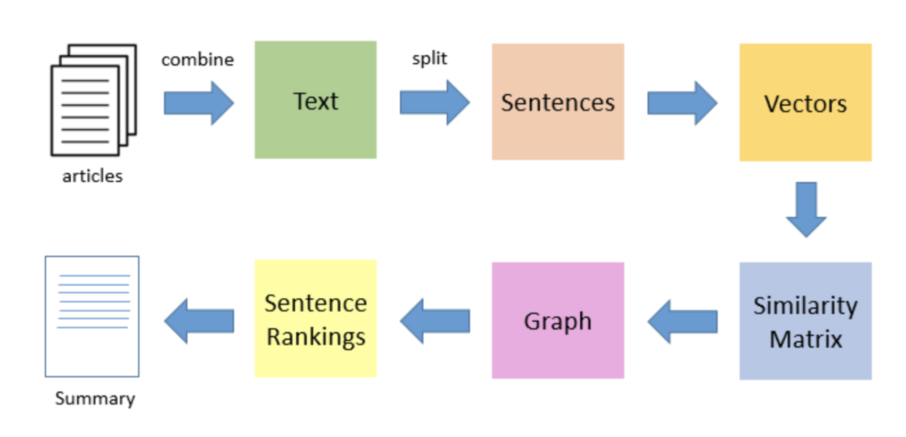

## Extractive text summarization and classification of news articles
#### Theory and Methodology:

The text summarization is the process of providing concise and meaningful version of texts from various sources such as Twitter, Facebook, books and etc. There are two kinds of text summarization which are:
* Extractive Text Summarization.
* Abstractive Text Summarization.
  
<b><u>Extractive Text Summarization</u></b>:  
This method generates summary based on using phrases and sentences from the given text. Hence, finding right sentences and phrases for a summary generation is an important task in this method.   
<b><u>Abstractive Text Summarization</u></b>:  
This method generates entirely new summary using Natural Language processing techniques. The tokens present in the generated summary may not be available in the given text.

But, in this motebook, I am going to demonstrate the implementation of <b>Extractive Text Summarization</b> using <b>TextRank</b> algorithm and preserving <b> Abstractive Text Summarization</b> for performing comparative study between these two text summarization techniques for my master thesis.  

##### TextRank Algorithm

We need to have an understanding of <b>PageRank</b> algorithm before understanding TextRank algorithm because PageRank algorithm's working is similar to TextRank algorithm. PageRank algorithm's main purpose is to rank web pages based on the online search results. In order to rank the web pages, we need a <b>PageRank score</b> which is the probability of user visiting that web page. The scores are stored in a matrix of n X n dimension where n is the number of web pages.
The score presented in the matrix representes the user's transistion from one page to another. Likewise, TextRank uses sentences to instead of web pages.

    Source : <a href="https://licor.me/post/introduction-to-automatic-text-summarization/">Introduction to Automatic Text Summarization</a>

